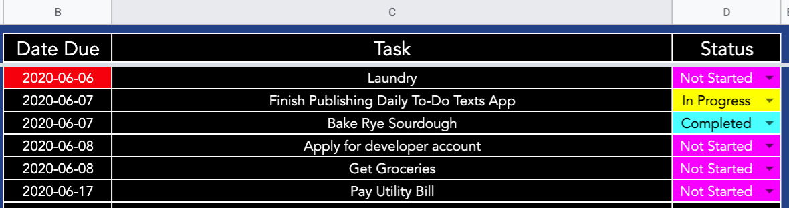

#Twilio To Do List Application

I rely heavily on a to-do list on a Google Sheet for day-to-day task management, and thought it would be useful for me to
get a text every morning with what I set out to achive for the day. This is a simple app that integrates Google Cloud 
Functions, Twilio, Google Sheets, and Pandas to send me a text digest of my to-do-list every morning.

##Things you need to have set up to recreate this:

1. Your Twilio account SID and auth token. Once you've created an account, you can find these on the front page of your 
Twilio [console](https://www.twilio.com/console)

2. An SMS-enabled Twilio phone number. Twilio gives you a trial number that is sms-enabled to begin playing around with.

3. A Twilio Messaging Service and ID. Go [here](https://www.twilio.com/console/sms/services) to create a messaging 
service for your platform and pair that resource with the phone number. This step is crucial! Your Twilio phone number 
needs to be paired with a messaging service in order for it to send and receive texts.

4. A Google Cloud Platform Account, from which you must make a Service Account and authorize the Sheets API on your 
platform. This is probably the most involved step for those who are unfamiliar with GCP, so I included a few resources below.
This script as written relies on a SECRETS.json file to access compute resources, which I just set up by modifying the 
.json file for the service account, with a few added key-value pairs added to hold my Twilio secrets and spreadsheet ID. 

5. A cell phone number on which to receive texts

6. A Google Sheet from which to pull this data, and it's spreadsheet ID, which can be found in the sheet URL after the '/d' 

    I have my sheet set up like below:

    

    The relevant columns are just Date Due, Task, and Status, which my script uses Pandas to filter through. Feel to play 
    around and adapt with this and adapt the script to your needs, but I set this script up to send me all tasks that are 
    not yet marked completed by the due date, coupled with all tasks due today.

I use Google Cloud Scheduler to send an HTTP trigger to the Cloud Function containing this script every morning at 7:40am.

